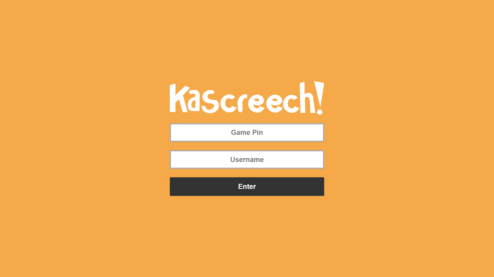
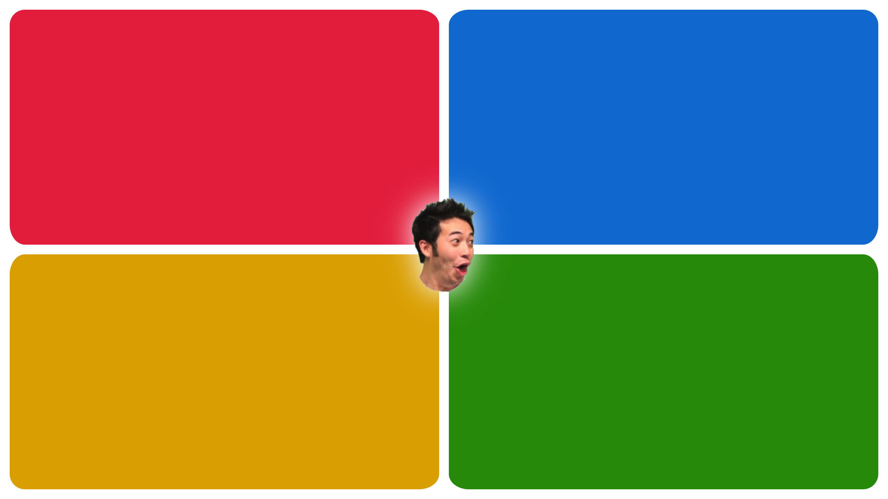

# Kascreech
Kascreech is a real-time multiplayer quiz platform to make learning fun, and is definitely not a blatent rip-off of Kahoot. Built in Rust and TypeScript, Kascreech is a joint project between myself and [flauntingspade4](https://github.com/flauntingspade4) which allows anyone to create a quiz and play it with their friends.

## How to Deploy
The `web` folder contains all of the front-end code to place on a web server. Make sure you change the constant `SERVER_IP` in both `chungus.ts` and `client.ts` to wherever you're hosting the back-end server. The Rust code for the back-end is in the `server` folder, where you just need to run `cargo run` to start the server. If you don't have Rust installed, you can download a binary from [the Releases page](https://github.com/w-henderson/Kascreech/releases) and run that instead, which will host the server on port 80.

## How to Play
The host player, whose screen will display the questions, should navigate to the `/chungus.html` route of the server, and press the *Create Lobby* button. All players should navigate to `/`, enter the game code and choose a username. Then, the game will play out just like a Kahoot game.

| Host UI | Client welcome UI | Client in-game UI |
| --- | --- | --- |
|  |  |  |