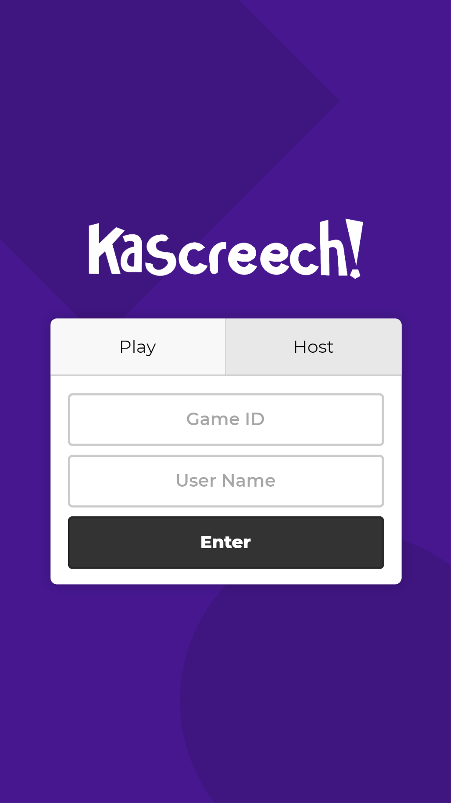

<p align="center">
    <br>
    
    
</p>

# Kascreech
Kascreech is a real-time multiplayer quiz platform to make learning fun, and certainly not a blatent rip-off of Kahoot. Built in Rust and React, Kascreech is a joint project between myself and [flauntingspade4](https://github.com/flauntingspade4) which allows anyone to play a quiz with their friends. A production build of Kascreech can be found at [kascreech.whenderson.dev](https://kascreech.whenderson.dev).

## How to Play
To select a quiz to play, visit [Kahoot's discover page](https://create.kahoot.it/discover). Kascreech has no database, so relies on Kahoot to store the actual quizzes! Once you've selected a quiz, copy its ID from the address bar (it should look something like `fb42b463-e549-4b18-a175-9ca8c510760a`), select "Host" on Kascreech, and enter the ID. Then hit "Create", and you're good to go! From there onwards, everything works exactly like Kahoot.

## How to Run

### Prerequisites
- Cargo and Rust
- NPM and Node
- This repository

Ensure the front-end dependencies are installed by running `npm i` in the client directory.

### Running the Development Server
1. Start the front-end by running `npm start` in the client directory.
2. Start the server by running `cargo run` in the server directory. You can pass the address to bind it to as an argument, for example `cargo run -- 0.0.0.0:8000` to run on port 8000.

### Deploying to Production
1. Build the React app for production by running `npm run build` in the client directory.
2. Build the Rust back-end by running `cargo build --release` in the server directory.
3. Deploy on your platform of choice.

### Command-Line Arguments
```
Kascreech
William Henderson <william-henderson@outlook.com>
Real-time multiplayer quiz platform to make learning fun, based on Kahoot and written in Rust and React.

USAGE:
    kascreech [addr] [static]

    [addr]    The address to bind the server to. Defaults to `0.0.0.0:80`
    [static]  The path to the front-end's static files. Defaults to `./client/build`
```

## Tech Stack

### Client
- Written using [React](https://reactjs.org/)
  - [Create React App](https://create-react-app.dev/) toolchain
  - [TypeScript](https://www.typescriptlang.org/)
  - [Sass](https://sass-lang.com/) for styling
  - [Material Community Icons](https://materialdesignicons.com/)

### Server
- Written in [Rust](https://www.rust-lang.org/)
  - [Humphrey](https://github.com/w-henderson/Humphrey/tree/master/humphrey) for serving static content and communicating with the Kahoot API
  - [Humphrey WebSocket](https://github.com/w-henderson/Humphrey/tree/master/humphrey-ws) for handling WebSocket connections
  - [Humphrey JSON](https://github.com/w-henderson/Humphrey/tree/master/humphrey-json) for communicating with the client
- Hosted using [GCP Compute Engine](https://cloud.google.com/compute)
  - 1x `f1-micro` in `us-east1-b`
- Proxied through [Cloudflare](https://cloudflare.com)

### Cloudflare
Cloudflare is used to allow access to the WebSocket through HTTPS despite the Kascreech server itself not supporting it.

## Screenshots

### Desktop
| | |
| --- | --- |
|  |  |

| | |
| --- | --- |
|  |  |

### Mobile
| | | | |
| --- | --- | --- | --- |
|  |  |  |  |